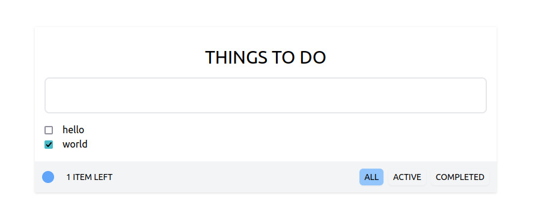

<h1>To do App</h1>

Simple To Do app developed using React JS and Tailwind CSS.

You can check the project running [here](https://todo-react-tailwind-gamma.vercel.app/)

In the project directory, you can run:

### `npm install`
### `npm start`

Runs the app in the development mode.\
Open [http://localhost:3000](http://localhost:3000) to view it in your browser.
